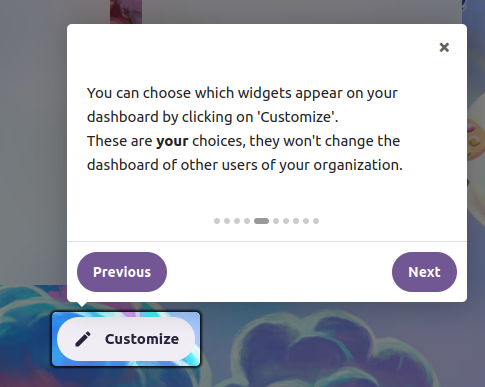
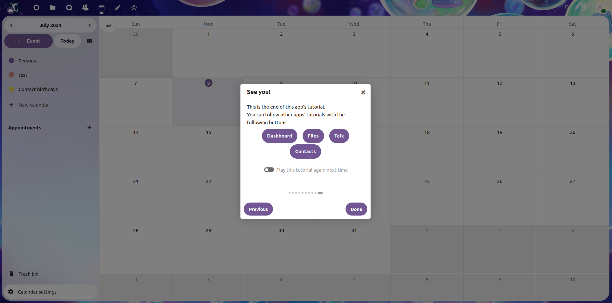

# Define your own tutorials

The intros app comes with tutorials for the following apps:

- Dashboard
- Files
- Contacts
- Calendar
- Talk
- User settings

You can modify those tutorials to fit your needs, or add a new app.

## JSON Files structure 

The JSON files define the tutorial of each app. You can define an tutorial for any app you want, as well as the user/admin menu, and an app's aside.

The files are organized as follows:

- a single structure file that describes the path the tutorials will follow (the elements to focus, open...)
- a content file per language that describes the displayed content (the text of the tutorial)

You can define multiple languages. The content files are named according to the language (`fr.json`, `en.json`, ...), and are stored in the `data` directory. The app automatically detects the user's language and launches the tutorial accordingly. **You need an english tutorial**, since the app will fallback to the `en.json` file if the user's language is not defined.

Your content files need to follow the structure file.

If you create new languages files, you'll also need to add it to the config. Run the following command.

**You must run this command if you add new languages, otherwise the app won't know they have been added and won't display them!**

```
occ config:app:set intros introsLanguages --value="<list_of_languages>"
```

With your available languages codes separated by a comma (for example : `--value="en,fr,it"`), and matching the content files in your `data` directory.

### Structure file

**Syntax example:**

```json
{
    {
    "dashboard": {
        "steps": [
            {
                "element": ""
            },
            {
                "element": "div#header-menu-user-menu > div.header-menu__content > ul > li#profile",
                "open": "nav#user-menu > button",
                "position": "left"
            }
        ]
    },
    "files": {
        "steps": [
            {
                "element": "tr.files-list__row",
                "hover": true
            },
            {
                "links": [
                    "dashboard",
                    "calendar",
                    "spreed",
                    "contacts"
                ]
            }
        ]
    }
}
```

(See larger examples in [data](./data/) and [examples](./examples/)).

**Reference:**

The app names are the names displayed in the URL. You have to follow the general syntax as above.

- `element`: the query of the element to focus. This field will be used by JS to find the element using `document.querySelector`. *Optional: if not provided, or if the element couldn't be found, the tooltip will be shown in the middle of the viewport (default intro.js behaviour).*
- `open`: the query of the element to click before focusing the `element`. This app can click on an element, e.g. to open a menu and focus on an element inside of it (that wouldn't be visible before clicking on it). *Optional, has to be a clickable HTML element (e.g. a button).*
- `position`: the position of the tooltip relative to the element it's focusing (see [intro.js docs](https://introjs.com/docs/examples/basic/tooltip-positions)). *Optional.*
- `hover`: whether an element has to be hovered to be visible. Actually sets the element's display style property to block while it is focused. *Optional.*
- `links`: a list of link to other apps to be displayed in the tooltip. The links lead to the related app and launches its tutorial. *Optional. All of the listed apps have to be installed and have a tutorial.*

### Content files

**Syntax example:**

```json
{
    "dashboard": {
        "name": "Dashboard",
        "steps": [
            {
                "title": "Welcome!",
                "paragraphs": [
                    "Welcome to your Nextcloud's dashboard.",
                    "<br>",
                    "Would you like to follow a short tutorial on how to use Nextcloud ?"
                ],
                "choices": [
                    {
                        "success": false,
                        "label": "No"
                    },
                    {
                        "success": true,
                        "label": "Yes"
                    }
                ]
            },
            {
                "paragraphs": [
                    "Change your account's personal information here."
                ]
            }
        ]
    },
    "files": {
        "name": "Files",
        "steps": [
            {
                "paragraphs": [
                    "You can find all your files and folders at the center of this page."
                ]
            },
            {
                "title": "See you!",
                "paragraphs": [
                    "This is the end of this app's tutorial.",
                    "You can follow other apps' tutorials with the following buttons:"
                ]
            }
        ]
    }
}
```

(See larger examples in [data](./data/) and [examples](./examples/)).


**Reference:**

You can create one content file per language (`fr.json`, `en.json`, ...), but you always need an english one (`en.json`), since it is the default one. They have to follow the structure file: the steps are described in the same order, so the first step of the `files` app in a content file will be linked to the element of the first step of the `files` app in the structure file. You also need to run the config command if you add new languages (see [JSON Files structure](##json-files-structure)).

- `title`: the title shown at the top of the tooltip. *Optional.*
- `paragraphs`: the text in the tooltip. Can be in HTML format. *Optional, but you should put at least one paragraph.*
- `img`: the URL of an image. Will be shown before the text. *Optional.*
- `choices`: providing a Yes/No choice to the user. The success button will go to the next step, the other will close the tutorial. *Optional.*

## Tutorials in asides

You can make a tour for the aside part of an app (the part that opens on the right, e.g. when opening the 'share' menu in *files*). You define it as a normal app, with a custom name. There are two possibilities:

- the section you want to focus on is the aside of an app : the name is `[app]-aside`
- the section you want to focus on is **a tab** in the aside of an app : the name is `[app]-aside-[tab_name]`. The tab name is taken from the element id in the HTML. For example, the section of the *sharing* tab in the *files* app has the `tab-sharing` id, so the tab name is `tab-sharing`.

Tutorials in asides will start automatically when the aside/tab is opened.

# Settings menu

This app features a menu in the personal user settings menu of Nextcloud. The user can enable or disable the tours from there. When a tour is enabled, it will play automativally when the user opens the related app.


The aside tours are linked to their upper app in this menu (enabling the tutorial for *files* will enable the one for the *sharing* tab of *files*), but not outside of it (marking the *files* tour as "not show again" at the end of it won't disable the *sharing* tour).

# Examples






A "play again" button is displayed on the last tooltip of the tour. It is displayed automatically and keeps track of whether the user should see the tour for the associated app again or not.

# Use in Framaspace

The tutorials used in Framaspace are available in the [examples/framaspace](./examples/framaspace/) folder. To use them, simply replace the content of the `data` directory with the content of the `examples/framaspace` directory, and rename the files (remove the `.example`).