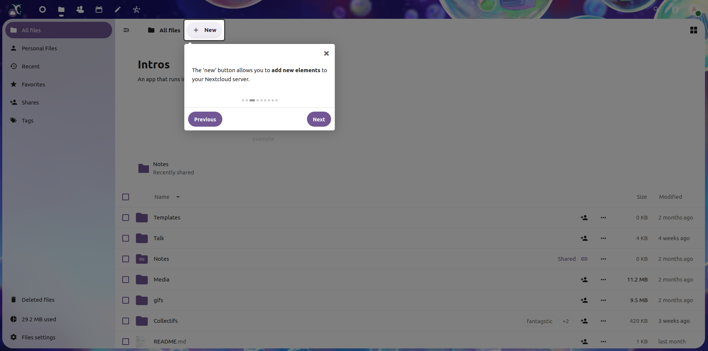
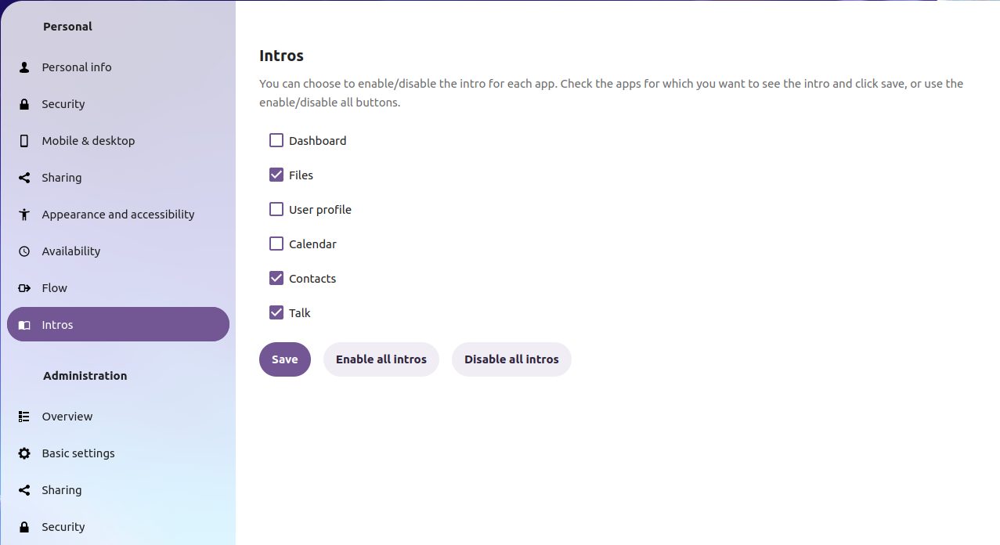
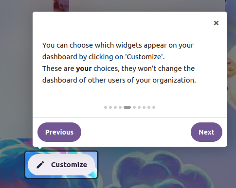
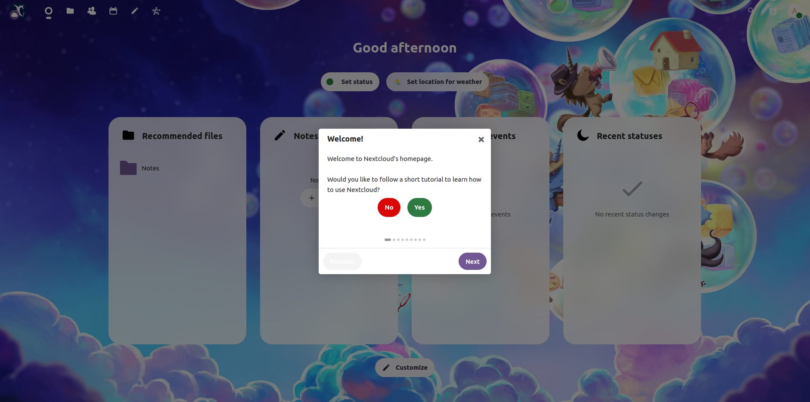
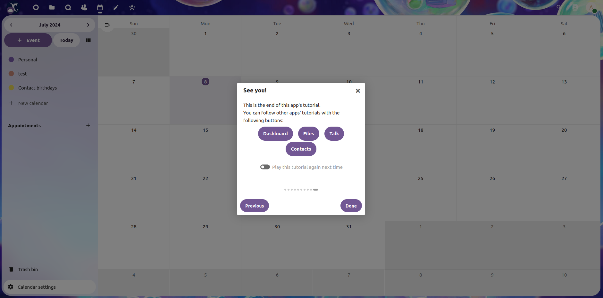

# Intros

An app that runs [intro.js](https://introjs.com/) tutorials in Nextcloud apps for new users.



## Installation

> This app is now available on the [nextcloud app store](https://apps.nextcloud.com/apps/intros). You can download it from there or install it from the apps section in your Nextcloud.

### Dev installation

Clone this repo in the `apps-extra` directory of your dev environment. If you're in a production environment, clone in the `apps` directory.

Install the dependencies and build the frontend files:

```
npm install
npm run dev
```

Finally, enable the app in the Apps section in Nextcloud.

### Production installation

Check out the [releases](https://framagit.org/framasoft/framaspace/custom-apps/intros/-/releases) and download the app's package from there. Extract the downloaded archive into the `apps` directory and enable the app to start using it. The app has been tested for version 28-30.

## Usage

### Admin

This app implements [intro.js](https://introjs.com/) into Nextcloud. 

The app comes with pre-bundled tutorials for the following apps:

- Dashboard
- Files
- Contacts
- Calendar
- Talk
- User settings

If you want something more custom, you can define your own tutorials in json files. Find some examples in the [examples](./examples/) folder, and details on the files syntax in the [documentation](./DOCS.md).

### User

The tutorials will be shown to the users automatically on their first visit.

Users can enable or disable the tutorial of each app in the user settings menu.



## Examples







## Contribute 

Contributions are welcome! Check the [issue list](https://framagit.org/framasoft/framaspace/custom-apps/intros/-/issues) to find some issue to fix or report a problem.

You can also contribute to translating this app via [weblate](https://weblate.framasoft.org/projects/framaspace-intro/).